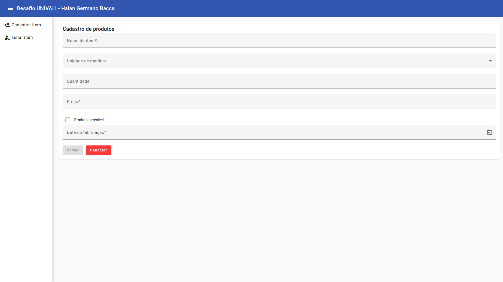

# Desafio UNIVALI - Programador Júnior



> Tela Inicial do Sistema.

### Descrição do Projeto

Sistema web para cadastro, edição, deleção e listagem de produtos.

A aplicação é composta por 2 páginas, sendo uma para cadastro e outra para listagem. Ambas as páginas possuem um menu lateral, localizado à esquerda, com links para as mesmas, além de um sistema de navegação estrutural.

O projeto foi desenvolvido utilizando o framework front-end `Angular` e a biblioteca de componentes de interface `Angular Material`.

Os dados são persistidos no formato JSON, fazendo uso da LocalStorage, adicionando, removendo e editando itens do JSON em questão. Não foi realizada a utilização de APIs. Cada página será melhor descrita a seguir:

## Formulário

| Campo              |       Tipo        |          Obrigatoriedade           |                                                                                                                  Validação |
| :----------------- | :---------------: | :--------------------------------: | -------------------------------------------------------------------------------------------------------------------------: |
| Nome do item       |       Texto       |                Sim                 |                                                                           Tamanho máximo de 50 caracteres (somente letras) |
| Unidade de medida  |   Enumeração\*    |                Sim                 |                                                                                                                          - |
| Quantidade         |     Numérico      |                Não                 |                                                                            Varia conforme a regra da unidade de medida\*\* |
| Preço              |     Monetário     |                Sim                 |                                                                                         Validação de campo monetário\*\*\* |
| Produto perecível  | Checkbox booleano |                Sim                 |                                                                                                                          - |
| Data de validade   |       Data        | Somente se o produto for perecível | Data no formato pt-BR. Caso a data de validade seja inferior a data atual, deve informar que o produto se encontra vencido |
| Data de fabricação |       Data        |                Sim                 |                          Data no formato pt-BR e não pode ser superior a data de validade (caso seja um produto perecível) |

\* Enumeração contendo os seguintes valores: Litro, Quilograma ou Unidade.

\*\* Regra da unidade de medida:
- Campos com unidade de medida em Litro devem permitir somente números, com até 3 casas decimais e apresentar a abreviatura "lt" ao final do campo (addon);
- Campos com unidade de medida em Quilograma devem permitir somente números, com até 3 casas decimais e apresentar a abreviatura "kg" ao final do campo (addon);
- Campos com unidade de medida em Unidade devem permitir somente números inteiros e apresentar a abreviatura "un" ao final do campo (addon);

\*\*\* Validação de campo monetário inclui exibição do tipo de moeda no início do campo e limite de casas decimais utilizando máscara (preenchimento da direita para a esquerda).

O formulário deve possuir dois botões, um para salvar e outro para cancelar. Ao selecionar o botão de salvar, caso esteja editando um item, deve salvar essas alterações, do contrário, um novo será adicionado. O botão de cancelar direciona o usuário para a tela de listagem.

## Listagem

- A listagem exibe uma tabela com os itens cadastrados, bem como botões para edição e exclusão de cada item, e um botão para adicionar um novo item.
- Ao clicar em excluir o usuário deverá ser questionado se realmente deseja excluir o item em questão (caso sim, o item deverá ser removido e exibida uma notificação de sucesso ou erro).
- Ao clicar em editar, o usuário deverá ser redirecionado para o formulário, carregado com os dados do item em questão.
- O botão de adicionar apenas redirecionará para a página do formulário.


## 💻 Pré-requisitos

Antes de começar, verifique se você atende aos seguintes requisitos:

- Você possui o `Node` e o `Angular` instalados em sua máquina.

### Inicialização do Aplicativo

```
# Baixando o projeto
Após baixar o projeto, execute o comando: `npm install`.
Caso encontre alguma vulnerabilidade execute o comando: `npm audit fix`.

# Executando o projeto
Abra um terminal da raiz do projeto.
Inicialize o projeto com o comando: `ng serve --o`.
Por padrão o projeto é executado no endereço: `http://localhost:4200`.
```
